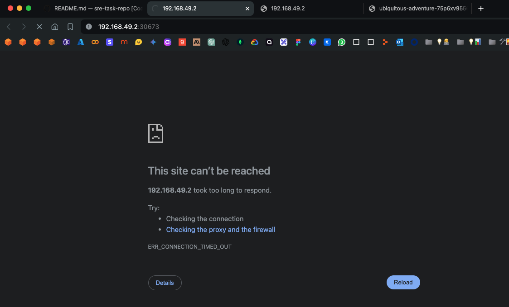
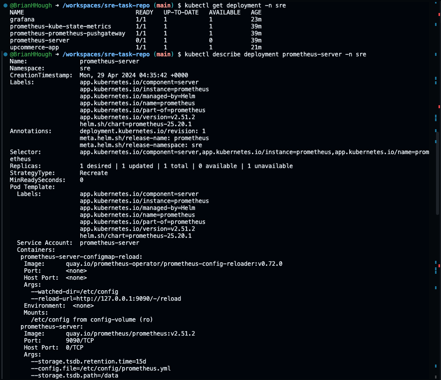
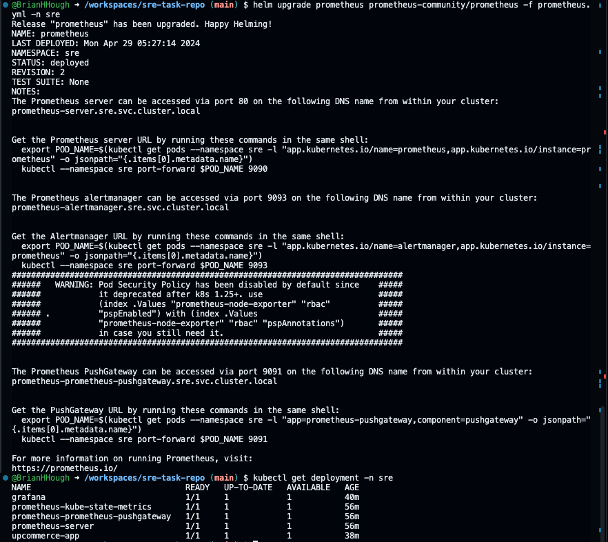
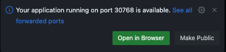
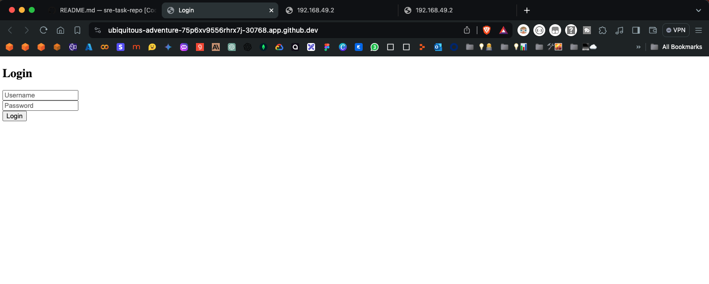
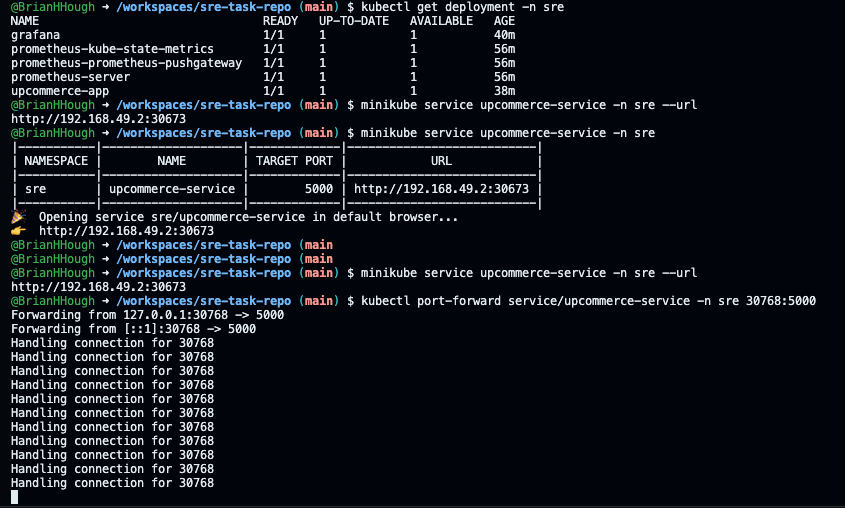

# UpCommerce 

## Step 1: Start Minikube
```bash
minikube start
```

## Step 2: Create namespace for container
```bash
kubectl create namespace sre
```

## Step 3: Define Prometheus configuration
```yaml
serverFiles:
# Insert the correct values in all parameters marked with "#TODO"
  alerting_rules.yml:
      groups:
      - name: NodeDown
        rules:
        # Alert for any instance that is unreachable for >5 minutes.
        - alert: InstanceDown
          expr: up{job="kubernetes-nodes"} == 0
          for: 2m
          labels:
            severity: page
          annotations:
            host: "{{ $labels.kubernetes_io_hostname }}"
            summary: "Instance down"
            description: "Node {{ $labels.kubernetes_io_hostname }} has been down for more than 5 minutes."
      - name: low_memory_alert
        rules:
        # Low Memory Alert
        - alert: LowMemory
          expr: (node_memory_MemAvailable_bytes / node_memory_MemTotal_bytes) * 100 < 85
          for: 2m
          labels:
            severity: warning
          annotations:
            host: "{{ $labels.kubernetes_node }}"
            summary: "{{ $labels.kubernetes_node }} Host is low on memory. Only {{ $value }}% left"
            description: "{{ $labels.kubernetes_node }} node is low on memory. Only {{ $value }}% left"
        # Kube Persistent Volume Errors Alert
        - alert: KubePersistentVolumeErrors
          expr: kube_persistentvolume_status_phase{job="kubernetes-service-endpoints",phase=~"Failed|Pending"} > 0
          for: 2m
          labels:
            severity: critical
          annotations:
            description: The persistent volume {{ $labels.persistentvolume }} has status {{ $labels.phase }}.
            summary: PersistentVolume is having issues with provisioning.
        # Kube Pod Crash Looping Alert
        - alert: KubePodCrashLooping
          expr: rate(kube_pod_container_status_restarts_total{job="kubernetes-service-endpoints",namespace=~".*"}[5m]) * 𝟼𝟶 * 𝟻 > 𝟶
          for: 2m
          labels:
            severity: warning
          annotations:
            description: Pod {{ $labels.namespace }}/{{ $labels.pod }} ({{ $labels.container }}) is restarting {{ printf "%.2f" $value }} times / 5 minutes.
            summary: Pod is crash looping.
        # Kube Pod Not Ready Alert
        - alert: KubePodNotReady
          expr: sum by(namespace, pod) (max by(namespace, pod) (kube_pod_status_phase{job="kubernetes-service-endpoints",namespace=~".*",phase=~"Pending|Unknown"}) * on(namespace, pod)    group_left(owner_kind) topk by(namespace, pod) (1, max by(namespace, pod, owner_kind) (kube_pod_owner{owner_kind!="Job"}))) > 0
          for: 2m
          labels:
            severity: warning
          annotations:
            description: Pod {{ $labels.namespace }}/{{ $labels.pod }} has been in a non-ready state for longer than 5 minutes.
            summary: Pod has been in a non-ready state for more than 2 minutes.
```

## Step 4: Add Prometheus-Community to Minikube

### Run:
```bash
helm repo add prometheus-community https://prometheus-community.github.io/helm-charts
```

This command adds a Helm repository named prometheus-community and sets its URL to https://prometheus-community.github.io/helm-charts. Helm repositories are used to store and distribute Helm charts, which are packages of pre-configured Kubernetes resources.med 

### Run:
```bash
helm repo update
```

This command updates the local cache of Helm charts from all configured Helm repositories. It ensures that you have the latest information about available charts and their versions.

### Run:
```bash
helm install prometheus prometheus-community/prometheus \
  -f prometheus.yml \
  --namespace sre \
```

This command installs the Prometheus chart from the prometheus-community repository into the Kubernetes cluster.

Output:
```bash
NAME: prometheus
LAST DEPLOYED: Mon Apr 29 04:35:41 2024
NAMESPACE: sre
STATUS: deployed
REVISION: 1
TEST SUITE: None
NOTES:
The Prometheus server can be accessed via port 80 on the following DNS name from within your cluster:
prometheus-server.sre.svc.cluster.local


Get the Prometheus server URL by running these commands in the same shell:
  export POD_NAME=$(kubectl get pods --namespace sre -l "app.kubernetes.io/name=prometheus,app.kubernetes.io/instance=prometheus" -o jsonpath="{.items[0].metadata.name}")
  kubectl --namespace sre port-forward $POD_NAME 9090


The Prometheus alertmanager can be accessed via port 9093 on the following DNS name from within your cluster:
prometheus-alertmanager.sre.svc.cluster.local


Get the Alertmanager URL by running these commands in the same shell:
  export POD_NAME=$(kubectl get pods --namespace sre -l "app.kubernetes.io/name=alertmanager,app.kubernetes.io/instance=prometheus" -o jsonpath="{.items[0].metadata.name}")
  kubectl --namespace sre port-forward $POD_NAME 9093
#################################################################################
######   WARNING: Pod Security Policy has been disabled by default since    #####
######            it deprecated after k8s 1.25+. use                        #####
######            (index .Values "prometheus-node-exporter" "rbac"          #####
###### .          "pspEnabled") with (index .Values                         #####
######            "prometheus-node-exporter" "rbac" "pspAnnotations")       #####
######            in case you still need it.                                #####
#################################################################################


The Prometheus PushGateway can be accessed via port 9091 on the following DNS name from within your cluster:
prometheus-prometheus-pushgateway.sre.svc.cluster.local


Get the PushGateway URL by running these commands in the same shell:
  export POD_NAME=$(kubectl get pods --namespace sre -l "app=prometheus-pushgateway,component=pushgateway" -o jsonpath="{.items[0].metadata.name}")
  kubectl --namespace sre port-forward $POD_NAME 9091

For more information on running Prometheus, visit:
https://prometheus.io/
```

## Step 5: Install Grafana

### Run:
```
helm repo add grafana https://grafana.github.io/helm-charts
```

This command adds a Helm repository named grafana and sets its URL to https://grafana.github.io/helm-charts. Helm repositories are used to store and distribute Helm charts, which are packages of pre-configured Kubernetes resources for Grafana in this case.

### Run:
```bash
helm repo update
```

This command updates the local cache of Helm charts from all configured Helm repositories. It ensures that you have the latest information about available charts and their versions.


### Run:
```bash
helm install grafana grafana/grafana \
 --namespace sre \
 --set adminPassword="admin"
```

This command installs the Grafana chart from the grafana repository into the Kubernetes cluster.

Output:
```bash
NAME: grafana
LAST DEPLOYED: Mon Apr 29 04:52:05 2024
NAMESPACE: sre
STATUS: deployed
REVISION: 1
NOTES:
1. Get your 'admin' user password by running:

   kubectl get secret --namespace sre grafana -o jsonpath="{.data.admin-password}" | base64 --decode ; echo


2. The Grafana server can be accessed via port 80 on the following DNS name from within your cluster:

   grafana.sre.svc.cluster.local

   Get the Grafana URL to visit by running these commands in the same shell:
     export POD_NAME=$(kubectl get pods --namespace sre -l "app.kubernetes.io/name=grafana,app.kubernetes.io/instance=grafana" -o jsonpath="{.items[0].metadata.name}")
     kubectl --namespace sre port-forward $POD_NAME 3000

3. Login with the password from step 1 and the username: admin
#################################################################################
######   WARNING: Persistence is disabled!!! You will lose your data when   #####
######            the Grafana pod is terminated.                            #####
#################################################################################
```


## Step 6: Deploy Prometheus x Helm
Run the code below to create a deployment and service 

### Run:
```bash
kubectl apply -f deployment.yml -n sre
```

### Run:
```bash
kubectl apply -f service.yml -n sre
```

## Step 7: Ensure UpCommerce's website is up


### Run:
```bash
minikube service upcommerce-service -n sre
```

This command creates a Minikube service and forwards it to a port where you can access it. You can try transacting on UpCommerce's site which is forwarded to this port using admin as both the username and password. 

Output:
```bash
|-----------|--------------------|-------------|---------------------------|
| NAMESPACE |        NAME        | TARGET PORT |            URL            |
|-----------|--------------------|-------------|---------------------------|
| sre       | upcommerce-service |        5000 | http://192.168.49.2:30673 |
|-----------|--------------------|-------------|---------------------------|
🎉  Opening service sre/upcommerce-service in default browser...
👉  http://192.168.49.2:30673
```


### Run:
```bash
minikube service upcommerce-service -n sre --url
```

This command fetches the URL associated with the `upcommerce-service` service.

Output: 
`http://192.168.49.2:30673`

### Run:
```bash
kubectl get pod,svc -n sre
```

This command checks all the running services in the container by namespace sre

Output:
```bash
NAME                                                    READY   STATUS             RESTARTS      AGE
pod/grafana-557d966c8c-k4z8x                            1/1     Running            0             6m22s
pod/prometheus-alertmanager-0                           1/1     Running            0             22m
pod/prometheus-kube-state-metrics-6b7d7b9bd9-8h6sb      1/1     Running            0             22m
pod/prometheus-prometheus-node-exporter-r6988           1/1     Running            0             22m
pod/prometheus-prometheus-pushgateway-568fbf799-dwhpr   1/1     Running            0             22m
pod/prometheus-server-579dc9cfdf-42njr                  1/2     CrashLoopBackOff   9 (45s ago)   22m
pod/upcommerce-app-8698d8bd45-72fb7                     1/1     Running            0             4m56s

NAME                                          TYPE        CLUSTER-IP       EXTERNAL-IP   PORT(S)          AGE
service/grafana                               ClusterIP   10.103.158.113   <none>        80/TCP           6m23s
service/prometheus-alertmanager               ClusterIP   10.99.69.179     <none>        9093/TCP         22m
service/prometheus-alertmanager-headless      ClusterIP   None             <none>        9093/TCP         22m
service/prometheus-kube-state-metrics         ClusterIP   10.102.92.159    <none>        8080/TCP         22m
service/prometheus-prometheus-node-exporter   ClusterIP   10.100.144.57    <none>        9100/TCP         22m
service/prometheus-prometheus-pushgateway     ClusterIP   10.110.73.14     <none>        9091/TCP         22m
service/prometheus-server                     ClusterIP   10.98.38.186     <none>        80/TCP           22m
service/upcommerce-service                    NodePort    10.96.42.105     <none>        5000:30673/TCP   4m40s
```

### Run:
```bash
minikube service list
```

This command lists all of the services and their ports.

Output:
```bash
|-------------|-------------------------------------|--------------|---------------------------|
|  NAMESPACE  |                NAME                 | TARGET PORT  |            URL            |
|-------------|-------------------------------------|--------------|---------------------------|
| default     | kubernetes                          | No node port |                           |
| kube-system | kube-dns                            | No node port |                           |
| sre         | grafana                             | No node port |                           |
| sre         | prometheus-alertmanager             | No node port |                           |
| sre         | prometheus-alertmanager-headless    | No node port |                           |
| sre         | prometheus-kube-state-metrics       | No node port |                           |
| sre         | prometheus-prometheus-node-exporter | No node port |                           |
| sre         | prometheus-prometheus-pushgateway   | No node port |                           |
| sre         | prometheus-server                   | No node port |                           |
| sre         | upcommerce-service                  |         5000 | http://192.168.49.2:30673 |
|-------------|-------------------------------------|--------------|---------------------------|
```


### 🐞 Debugging: 

The issue was then that the URL for `upcommerce-service` would not go to a real website



This was because of an issue 

### Run:
```bash
kubectl get deployment -n sre
```

This gets the information about the deployment of namespace sre. Notice that the `promoetheus-server` is at 0/1

```bash
NAME                                READY   UP-TO-DATE   AVAILABLE   AGE
grafana                             1/1     1            1           23m
prometheus-kube-state-metrics       1/1     1            1           39m
prometheus-prometheus-pushgateway   1/1     1            1           39m
prometheus-server                   0/1     1            0           39m
upcommerce-app                      1/1     1            1           21m
```

To get more information, you can run `kubectl describe deployment prometheus-server -n sre`



### Run:
```bash
helm upgrade prometheus prometheus-community/prometheus -f prometheus.yml -n sre
```

This will take about 2-5 minutes to reconfigure/update.

### Run:
```bash
kubectl get deployment -n sre
```

This should now show `prometheus-server` running 1/1:
```bash
NAME                                READY   UP-TO-DATE   AVAILABLE   AGE
grafana                             1/1     1            1           40m
prometheus-kube-state-metrics       1/1     1            1           56m
prometheus-prometheus-pushgateway   1/1     1            1           56m
prometheus-server                   1/1     1            1           56m
upcommerce-app                      1/1     1            1           38m
```



## Step 8: Forward the port to access it

### Run: 
```bash
export POD_NAME=$(kubectl get pods --namespace sre -l "app.kubernetes.io/name=alertmanager,app.kubernetes.io/instance=prometheus" -o jsonpath="{.items[0].metadata.name}")

kubectl --namespace sre port-forward $POD_NAME 9093
```

The above command allows you to forward your Prometheus AlertManager to a port within your codespace (usually port 9093)

This outputs:
```bash
Forwarding from 127.0.0.1:9093 -> 9093
Forwarding from [::1]:9093 -> 9093
```

### Run:
```bash
export POD_NAME=$(kubectl get pods --namespace sre -l "app.kubernetes.io/name=prometheus,app.kubernetes.io/instance=prometheus" -o jsonpath="{.items[0].metadata.name}")

kubectl --namespace sre port-forward $POD_NAME 9090
```

This outputs:
```bash
POD_NAME 9090
Forwarding from 127.0.0.1:9090 -> 9090
Forwarding from [::1]:9090 -> 9090
```

The above command allows you to forward your Prometheus server to a port within your codespace (usually port 9090).

## Step 9: Ensure Kubernetes deployment is correct and working:

### Run:
```bash
minikube service upcommerce-service -n sre --url
```

Output the IP address generated by Kubernetes for the UpCommerce website: `http://192.168.49.2:30673`

### Then run: 
```bash
kubectl port-forward service/upcommerce-service -n sre 30768:5000
```

There will be a pop-up that shows up:



Port 5000 is the port in your service.yml file. Click on the Ports Tab on the Terminal Console. Next, Ctrl + click on the URL for the service port (30768)

🎉 The site is now live! 
The live URL is: https://ubiquitous-adventure-75p6xv9556rhrx7j-30768.app.github.dev/

Logged Out:


Logged In:


This open port will continue to serve requests for the connection to the port `:30768`




## Step 10: Commit code to my GitHub branch

- Check current branch: `git branch` 
    - Or switch to the right brnach: `git checkout branch-name`
- Stage changes: `git add .`
    - Or specify individual files
- Commit changes: `git commit -m "Your commit message"`
- Push commit to GitHub: `git push origin branch-name`
- Check status: `git status`
